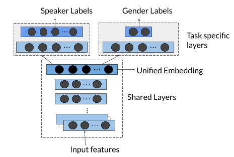

#  Unified Voice Embedding through Multi task Learning

![research]
[![Contributors][contributors-shield]][contributors-url]
[![Stargazers][stars-shield]][stars-url]
[![Forks][forks-shield]][forks-url]
[![Issues][issues-shield]][issues-url] 


- <b>Project Lead</b>
    1. **Dr. Uthayasanker Thayasivam** (talk forum profile link)
- <b>Contributors</b>
    1. [**Rajenthiran Jenarthanan**](https://talk.aaivu.org/u/jenarthanan)
    2. **Lakshikka Sithamparanathan** (talk forum profile link)
    3. **Saranya Uthayakumar** (talk forum profile link)

<b>Useful Links </b>

- Pretrained Model : [Pretrained Models](https://drive.google.com/drive/folders/1Hw2BMs0clCrKoYIq0B0PWXnxuoVUPGci?usp=sharing)
- Libri Speech : [LibriSpeech](http://www.openslr.org/12/)
- Talk Forum : [Forum](https://talk.aaivu.org/t/hive-mtl-unified-voice-embedding-through-multi-task-learning/32)

---

## Summary

Speech technologies is one of the evolving and highly demanded area for the past few decades due to the huge progress brought by machine learning technology. Especially the past decade has brought tremendous progress which includes the introduction of conversational agents. In this work we describe a multi-task deep metric learning system to learn a single unified audio embedding which can be used to power our multiple audio/speaker specific tasks. The solution we present not only allows us to train for multiple application objectives in a single deep neural network architecture, but takes advantage of correlated information in the combination of all training data from each application to generate a unified embedding that outperforms all specialized embeddings previously deployed for audio/speaker specific task.

## Getting started
### Install dependencies
#### Requirements
- tensorflow>=2.0
- keras>=2.3.1
- python>=3.6
```bash
pip install -r requirements.txt
```

If you see this error: `libsndfile not found`, run this: `sudo apt-get install libsndfile-dev`.


### Training

The code for training is available in this repository.
```bash
sudo chmod -R 777 hive-mtl/ # Give write permision to hive-mtl
pip uninstall -y tensorflow && pip install tensorflow-gpu
./hive-mtl download_librispeech # Download Librispeech dataset
./hive-mtl build_mfcc
./hive-mtl build_model_inputs
./hive-mtl train_mtl
```
NOTE: If you want to use your own dataset, make sure you follow the directory structure of librispeech. Audio files have to be in `.flac`. format. If you have `.wav`, you can use `ffmpeg` to make the conversion. Both formats are flawless (FLAC is compressed WAV).


### Architecture Diagram




## References

* [Deep Speaker](https://arxiv.org/pdf/1705.02304.pdf) : An End-to-End Neural Speaker Embedding System by Chao Li, Xiaokong Ma, Bing Jiang, Xiangang Li.
* [GitHub](https://github.com/philipperemy/deep-speaker)
## Acknowledgments

* Ketharan Suntharam
* Sathiyakugan Balakirshnan

---

### License

Apache License 2.0

### Code of Conduct

Please read our [code of conduct document here](https://github.com/aaivu/aaivu-introduction/blob/master/docs/code_of_conduct.md).

[project]: https://img.shields.io/badge/-Project-blue
[research]: https://img.shields.io/badge/-Research-yellowgreen


[contributors-shield]: https://img.shields.io/github/contributors/aaivu/aaivu-unified-voice-embedding.svg?style=flat-square
[contributors-url]: https://github.com/aaivu/aaivu-unified-voice-embedding/graphs/contributors
[forks-shield]: https://img.shields.io/github/forks/aaivu/aaivu-unified-voice-embedding.svg?style=flat-square
[forks-url]: https://github.com/aaivu/aaivu-unified-voice-embedding/network/members
[stars-shield]: https://img.shields.io/github/stars/aaivu/aaivu-unified-voice-embedding.svg?style=flat-square
[stars-url]: https://github.com/aaivu/aaivu-unified-voice-embedding/stargazers
[issues-shield]: https://img.shields.io/github/issues/aaivu/aaivu-unified-voice-embedding.svg?style=flat-square
[issues-url]: https://github.com/aaivu/aaivu-unified-voice-embedding/issues
